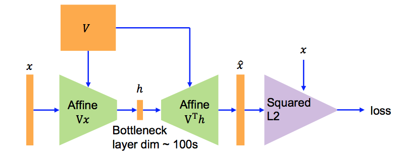

# Understanding Word Embeddings

Unlike dealing with images which are much more easily represented as numbers. words are more tricky. In order for predictive models to understand text, we need to develop a way to semantically represent text as a vector. We look at several models of word embeddings and show the mathematical intuition behind them. 

## One Hot Encoding

To first represent a vocabulary of words, we one-hot encode words into a vector the size of the vocabulary. 

$$
\dots,\ \textrm{fire, cat, house},\ \dots \rightarrow\begin{bmatrix}
\ddots & \vdots & \vdots & \vdots & \vdots \\
\dots & 1 & 0 & 0 & \dots \\
\dots & 0 & 1 & 0 & \dots \\
\dots & 0 & 0 & 1 & \dots \\
\vdots & \vdots & \vdots & \vdots & \ddots \\
\end{bmatrix}
$$

In the above representation, each vector has a 1 at the index $i$ that corresponds with the $i^{th}$ word in the vocabulary. As you can imagine, this can lead to a really high-dimensional matrix. 

## Latent Symantic Analysic

Since the vocabulary can be represented as a matrix, naturally we can consider a common method of dimensionality reduction like principal component analysis. Let $T$ represent the one-hot encoded vocabulary, and $U$ and $V$ represent the left singular matrix and the right singular matrix respectively. $S$ represents the diagonal matrix of singular values. 

$$
T = U^T S V
$$

To apply PCA, we take the $k$ highest singular values, and the first $k$ of the appropriate dimension of both $U$ and $V$, giving us instead a $k$ dimensional approximation of $T$. Since $T$ is so high dimensional, it's extremely costly to directly compute PCA. Thus we use an autoencoder to learn the lower dimensionality of $T$, representing the process of learning this lower dimensional embedding as a neural network below. $V$ is the lower dimensional embedding. 

## Word2vec

Instead of encoding based on the entire vocabulary, word2vec uses local context to encode words. We look at two implementations of local contexts for word embeddings. 

- Continuous Bag of Words (CBOW): predicts a center based on some number of context words.

- Skip-Grams: predict contexts words based on a center word. 

Similarly to LSA, we want to learn a lower dimensional representation of $T$, the one-hot encoded matrix of vocabulary words. In order to learn the vector representations for words, we attempt to maximize the probability of target word $w_i$ given the context $h_j$: $P(w_i|h_j) = \frac{exp(u_i \cdot v_j)}{\sum_{k=1}^{|\mathcal{V}}exp(u_k \cdot v_j)}$. Unfortunately this is hard to compute, but we can approximate this using noise-contrastive estimation (NCE) with negative sampling (NS). Essentially we want to show that the word we picked is better than randomly selecting a word. 

$$
\ell = -[\log P(d=1 | w_i, h_j) + \sum_{i=1}^{N} \log P(d=0|\tilde{w}, h_j)]
$$

If we do a large enough sample, we can assume by the law of large numbers that the summation can be simplified as follows:

$$
\ell = -[\log P(d=1 | w_i, h_j) + N \mathbb{E} \log P(d=0|\tilde{w}, h_j)]
$$

We approximate the value of $P(d=1 | w_i, h_j)$ and $P(d=0 | w_i, h_j)$  with the sigmoid operation. 

$$
P(d=1 | w_i, h_j) = \sigma(u_i \cdot v_j)
$$
$$
P(d=0 | w_k, h_j) = 1 - \sigma(u_k \cdot v_j) = \sigma(-u_k \cdot v_j)
$$

This gives us the final NCE loss with NS:

$$
\ell = -[\log  \sigma(u_i \cdot v_j) + N \mathbb{E} \log \sigma(-u_k \cdot v_j)]
$$

This can be a tricky process so we summarize the process of computing the NCE loss. Essentially, we learn two embeddings matrices, an embedding matrix for the input words (the context) and the embedding for the output words (the target). 

1. For a specific example contain target word $w_i$ with context words $c_1, c_2, \dots$, we get the current vector representation from the embedding matrix. We define the context vector as $v_j$ and the target vector as $u_i$
2. Since $v_j$ can be composed of many context words, we can either sum up or compute the mean across all the context vectors and use that as the $v_j$ vector. 
3. Randomly sample $N$ samples from the vocabulary. These are our $u_k$ that are wrong. 
4. Input these vectors into the loss function. We train the loss function using some optimization function, updating the embedding matrices accordingly during backprop. 

Using the word embedding approximated by the NCE loss, local contexts can capture information regarding relations between words. Below is a T-SNE diagram of a CBOW word embedding. 

Word2vec puts emphasis on small combinations of words and contexts which in reality could be unlikely. 

## Co-occurrence Matrix

$C_{ij}$ counts number of documents containing both words $i$ and $j$. A co-occurrence can also be defined on a window, counting the number of times both words co-occur within a given distance with each other. 

## GloVe

We are given the following loss function: 

$$
J(\theta) = \sum_{i, j=1}^{V} f(C_{ij})(u_i^T v_j + b_i + \tilde{b_j} - \log C_{ij})^2
$$

$C_{ij}$ is an element in the co-occurrence matrix, $u_i$ is the word embedding, $v_j$ is the context word embedding, and $b_i$ and $\tilde{b_j}$ are bias vectors. $f(.)$ is a function that satisfies: 

- $f(0) = 0$
- $f(x)$ is non-decreasing
- $f(x)$ saturates, meaning not too large for large x

An example of $f$: 

$$
f(x) = \begin{cases}
(x/x_{max})^\alpha\ & x<x_{max} \\
1 & o.w.
\end{cases}
$$

with $\alpha = \frac{3}{4}$ and $x_{max} = 100$ typically. 

## Siamese Network for Semantic Relatedness

